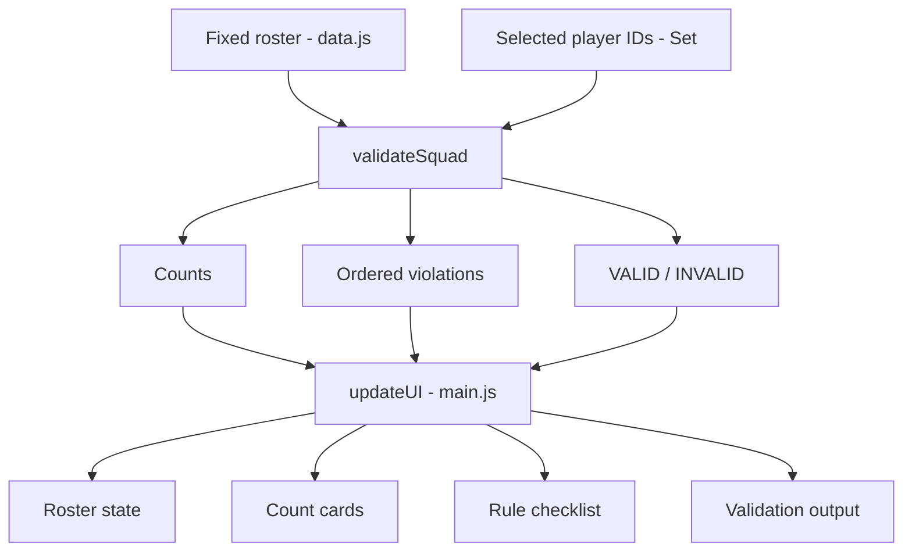

# Sports Squad Constraint Checker - AI-Assisted Coding Interview Report

**Candidate:** Badampudi Agasthya Anirudh  
**Project:** SI26_P07 - Sports Squad Constraint Checker  
**Repository:** `bnssaanirudh/Sports-Squad-Constraint-Checker`  
**Stack:** Vanilla JavaScript, HTML, CSS, Vite, Vitest

---

## 1. Executive Summary

This project is a compact browser-based checker for an inter-hostel futsal squad. The user manually selects players from a fixed nine-player roster, and the application validates that selection against the required squad constraints. It reports the current counts, pass/fail rule states, an overall `VALID` or `INVALID` result, and every applicable violation in the required deterministic order.

The application deliberately **does not** optimize, rank, generate, or recommend a squad. Its scope is validation only.

The development approach was intentionally AI-assisted but human-controlled: requirements were clarified first, risky edge cases were questioned, a four-step plan was created before coding, the solution was kept deliberately small, core validation was implemented separately from the DOM, tests were added incrementally, the UI was verified manually, and AI code-review suggestions were accepted or rejected based on the actual project scope.

### Final status

| Area | Result |
|---|---|
| Fixed roster | PASS |
| Valid baseline S01-S07 | PASS |
| Required S07 -> S08 invalid case | PASS |
| Six-player case | PASS |
| Cohort boundary of exactly 4 | PASS |
| Duplicate/unknown ID handling | PASS |
| UTILITY semantics | PASS |
| Deterministic violation ordering | PASS |
| Reset/sample synchronization | PASS |
| Pure validator separated from UI | PASS |
| Automated unit tests | 13 tests in repository |
| No squad recommendation/optimization | PASS |

---

## 2. Problem Understanding

The application validates a manually selected squad against these rules:

1. Exactly **7 distinct players** must be selected.
2. Exactly **1 GOALKEEPER** is required.
3. At least **2 DEFENDER** players are required.
4. At least **2 FORWARD** players are required.
5. No selected player may be `UNAVAILABLE`.
6. At most **4 YEAR_2** players may be selected.
7. At most **4 YEAR_3** players may be selected.
8. `UTILITY` contributes to squad size and cohort totals, but **does not** satisfy defender or forward minimums.
9. Unknown or duplicate player references return `INVALID_SELECTION_REFERENCE` and clear normal counts/results.
10. Regular violations are accumulated independently and returned in the required order.

The required baseline is S01-S07. The required one-change invalid example replaces S07 with S08.

### Evidence 01 - Initial requirements understanding

This was the first AI interaction: understand the assignment before writing code.


### Evidence 02 - Human review of risky requirements

Instead of immediately coding, the next interaction focused on the easiest requirements to misread: cohort boundary behavior, UTILITY semantics, violation ordering, invalid references, and stale state.


---

## 3. Implementation Plan

A four-step plan was created before implementation:

1. **Requirements and data model** - lock down the fixed roster, constraints, violation order, and acceptance cases.
2. **Pure validation and tests** - implement the domain logic independently of the browser and verify it with focused unit tests.
3. **UI and synchronization** - render the roster, controls, counts, rule states, and validation output from one selection state.
4. **Acceptance verification and documentation** - manually verify the required scenarios, review the code, capture evidence, and prepare the repository for presentation.

This plan kept the project small enough to explain and modify during a 30-40 minute interview.

### Evidence 03 - Final four-step plan


---

## 4. Technology and Design Decisions

The final choice was deliberately minimal:

- **Vanilla JavaScript** for application logic and DOM interaction.
- **HTML/CSS** for the single-screen interface.
- **Vite** for a simple development server.
- **Vitest** for focused automated unit tests.
- **No React, backend, database, authentication, or external application API.**

The reason was scope: this is a fixed local roster with one screen and a small deterministic validation engine. Adding a larger framework would have increased moving parts without improving the required behavior.

### Evidence 04 - Technology decision


### Evidence 05 - Minimal file structure

The architecture separates data, validation, UI control, styling, and tests without creating unnecessary layers.


### Final repository structure

```text
Sports-Squad-Constraint-Checker/
├── index.html
├── style.css
├── package.json
├── README.md
├── Student_SI26_P07-sports-squad-constraint-checker.pdf
├── prompt images/
├── src/
│   ├── data.js
│   ├── validator.js
│   └── main.js
└── tests/
    └── validator.test.js
```

Useful source links:

- [`src/data.js`](src/data.js) - fixed roster and default selection
- [`src/validator.js`](src/validator.js) - pure validation engine
- [`src/main.js`](src/main.js) - application state and DOM rendering
- [`tests/validator.test.js`](tests/validator.test.js) - automated rule/edge-case coverage
- [`README.md`](README.md) - setup and usage instructions

---

## 5. Project Setup and Fixed Data

The project scaffold was created first and confirmed runnable before business logic was added.

### Evidence 06 - Project running


The fixed roster was then added exactly as supplied in the assignment, preserving roster order.

### Evidence 07 - Fixed roster


Roster order matters for two reasons:

- the UI must preserve the supplied roster order;
- unavailable-player violations are emitted in roster order.

---

## 6. Validation Architecture

The core design decision was to keep validation independent of the browser:

```text
selected player IDs
        |
        v
validateSquad(selectedIds, roster)
        |
        +--> counts
        +--> ordered errors
        +--> isValid
        |
        v
UI rendering
```

`validateSquad()` has no DOM dependency and no side effects. This makes the business rules easy to unit test and makes live interview modifications safer.

### Evidence 08 - Validator design before implementation


### Reference integrity

Duplicate and unknown player IDs are handled before normal squad-rule evaluation. They return:

```text
INVALID_SELECTION_REFERENCE
```

with zeroed normal counts.

### Evidence 09 - Invalid reference handling


### Basic rules

The validator then applies the structural rules:

```text
size === 7
goalkeeper === 1
defender >= 2
forward >= 2
```

### Evidence 10 - Basic rules


### Availability rule

Unavailable players are reported without automatically changing the user's selection. This preserves the assignment's validation-only scope.

### Evidence 11 - Availability rule


### Cohort boundary

A cohort count of exactly four is valid; only a count greater than four produces a violation.

### Evidence 12 - Cohort boundary review


### Deterministic violation ordering

Regular violations are appended in the required order:

```text
SQUAD_SIZE_MUST_BE_7
GOALKEEPER_COUNT_MUST_BE_1
MINIMUM_DEFENDERS_NOT_MET
MINIMUM_FORWARDS_NOT_MET
PLAYER_UNAVAILABLE: <ID>          (roster order)
COHORT_LIMIT_EXCEEDED: YEAR_2 ...
COHORT_LIMIT_EXCEEDED: YEAR_3 ...
```

### Evidence 13 - Violation-order review


---

## 7. Testing Strategy

Testing was introduced before the full UI. The approach was incremental rather than asking AI to generate one large test suite at once.

### Required baseline

For S01-S07 the expected result is:

```text
VALID
size: 7
GOALKEEPER: 1
DEFENDER: 2
FORWARD: 2
UTILITY: 2
YEAR_2: 4
YEAR_3: 3
```

### Evidence 14 - Valid baseline test


### Required S07 -> S08 case

Expected violations, exactly in this order:

```text
PLAYER_UNAVAILABLE: S08
COHORT_LIMIT_EXCEEDED: YEAR_2 has 5, maximum 4
```

The size, goalkeeper, defender, and forward conditions remain satisfied.

### Evidence 15 - Required invalid test


### Required six-player case

Removing only S07 from the baseline must produce exactly:

```text
SQUAD_SIZE_MUST_BE_7
```

### Evidence 16 - Six-player test


### Edge-case coverage

The repository's test suite also covers:

- duplicate selected ID;
- unknown selected ID;
- exactly four players in a cohort;
- goalkeeper count;
- defender minimum;
- forward minimum;
- unavailable selection;
- UTILITY not satisfying defender minimum;
- UTILITY not satisfying forward minimum.

### Evidence 17 - Validator test suite


### Code ownership check

Before UI work, the validator was explicitly explained and reviewed so the generated code could be presented rather than blindly copied.

### Evidence 18 - Code-understanding step


---

## 8. User Interface and State Synchronization

The browser interface contains:

- the complete fixed roster;
- player selection checkboxes;
- Player ID, student, position, cohort, and availability;
- current squad and position/cohort counts;
- rule summary;
- `VALID` / `INVALID` output;
- complete ordered violation list;
- `Validate Squad`;
- `Load Valid Sample`;
- `Load Invalid Sample`;
- `Reset`.

S08 remains selectable even though it is unavailable, because the application must validate invalid choices rather than prevent them.

### Evidence 19 - Roster UI


The selection set is the application state. Each change calls the same validator and refreshes the derived counts/rules/result, preventing the UI from carrying forward old validation state.

### Evidence 20 - Valid browser state


### Evidence 21 - Sample and reset controls


### Stale-state review

The invalid -> reset -> valid flow was reviewed specifically to ensure previous violations and counts do not remain on screen.

### Evidence 22 - Stale-state review


---

## 9. UI Refinement

Visual refinement was intentionally delayed until the required behavior was working. This kept functionality ahead of cosmetic work.

The final CSS focuses on:

- clear roster readability;
- selected-row state;
- availability badges;
- compact count cards;
- readable PASS/FAIL states;
- prominent VALID/INVALID status;
- responsive layout.

### Evidence 23 - Final UI refinement prompt


### Evidence 24 - Final UI


---

## 10. Acceptance Audit

The completed application was checked against the original contract rather than only judged by whether it looked correct.

Key acceptance points:

| Scenario | Expected result |
|---|---|
| Baseline S01-S07 | VALID; 7 / 1 GK / 2 DEF / 2 FWD / 2 UTIL / YEAR_2 4 / YEAR_3 3 |
| S07 replaced by S08 | INVALID; exactly unavailable S08 then YEAR_2 cohort exceeded |
| Remove only S07 | INVALID; exactly `SQUAD_SIZE_MUST_BE_7` |
| Reset after invalid state | Baseline VALID state restored with no stale error |
| Cohort count exactly 4 | Allowed |

### Evidence 25 - Acceptance audit


---

## 11. Human Engineering Judgment During AI Code Review

One of the strongest parts of the workflow was not accepting every senior-style AI recommendation automatically.

The review raised four topics:

1. rebuilding the roster DOM could cause keyboard focus loss;
2. use of `innerHTML` could become an XSS concern if the fixed roster ever became untrusted external data;
3. listeners were being recreated with roster rerenders;
4. repeated `roster.find()` calls could theoretically be optimized with a `Map` for very large rosters.

The human decision was:

- **Accept and fix the focus/listener issue**, because it affected the current UI and accessibility.
- **Defer the hypothetical XSS redesign**, because the roster is fixed local trusted data in this assignment.
- **Reject the large-roster optimization for now**, because the contract has only nine fixed players and the simpler code is easier to explain.

This shows scope-aware engineering judgment rather than automatic acceptance of AI output.

### Evidence 26 - Code review


### Implemented correction

The final `main.js` now initializes the roster DOM once, attaches a single delegated `change` listener to `#roster-body`, and updates checkbox/row state without destroying the input elements on every selection change. The validator was left unchanged because the issue belonged to the UI layer.

### Evidence 27 - Targeted fixes after review


---

## 12. Final Test Evidence

After the targeted UI correction, the automated suite was run again to guard against regression.

### Evidence 28 - Final tests passing


The final repository contains **13 Vitest tests** across reference validation and squad rules/acceptance scenarios.

---

## 13. Documentation and Submission

The README contains technology choices, setup instructions, project structure, validation rules, unit-test information, required demo behavior, and architecture notes.

### Evidence 29 - README preparation


The project was then prepared and pushed to the final GitHub repository.

### Evidence 30 - Final repository push step


---

## 14. Final Architecture Summary



### Why this design works well for the interview

- The business rules are in one pure function.
- The UI does not duplicate validation logic.
- The selection set is the source of truth.
- The roster is fixed and easy to inspect.
- The test suite can validate the domain without a browser.
- Small live changes can usually be isolated to either `validator.js`, `main.js`, or `style.css`.

---

## 15. Trade-offs and Deferred Work

### Chosen deliberately

- Simple vanilla JavaScript over a UI framework.
- Fixed local data over a backend/database.
- Direct, readable rule checks over generalized rule-engine abstractions.
- `Array.find()` against nine players over a more complex lookup optimization.

### Deferred deliberately

- Optional formation visualization.
- Backend persistence.
- Authentication/accounts.
- Match/tournament management.
- Player ranking/recommendation/optimization.
- Scalability work for thousands of players because that is outside the supplied scope.

---

## 16. How AI Influenced the Solution

AI was used as a development partner in several different roles:

1. **Requirements analyst** - summarized the assignment and exposed likely edge-case mistakes.
2. **Planning partner** - helped create a four-step implementation plan before coding.
3. **Architecture reviewer** - proposed a minimal stack and file separation.
4. **Implementation assistant** - helped build the validator and UI incrementally.
5. **Testing assistant** - helped add focused tests one scenario at a time.
6. **Explainer** - walked through the validator to improve code ownership.
7. **Reviewer** - identified accessibility, security, maintainability, and scalability considerations.

The important point is that AI suggestions were not treated as automatically correct. They were checked against the original problem, tested, and sometimes narrowed or deferred based on scope.

---

## 17. Interview Demo Sequence

A short, reliable demo can be presented in this order:

### 1. Explain the goal - about 30 seconds

> "This is a validation-only tool for a fixed futsal roster. The user manually chooses players and the application reports whether every squad constraint is satisfied. It never recommends or generates a squad."

### 2. Explain architecture - about 60 seconds

> "I kept the fixed data in `data.js`, the business rules in a pure `validateSquad()` function, and the browser logic in `main.js`. That separation lets me test the rules independently and makes live modifications safer."

### 3. Show valid baseline

Click **Load Valid Sample** and point out:

```text
VALID
size = 7
GK = 1
DEF = 2
FWD = 2
UTILITY = 2
YEAR_2 = 4
YEAR_3 = 3
```

### 4. Show the required S07 -> S08 invalid case

Load the invalid sample or manually deselect S07 and select S08.

Point out that size and position requirements still pass, but the result is exactly:

```text
PLAYER_UNAVAILABLE: S08
COHORT_LIMIT_EXCEEDED: YEAR_2 has 5, maximum 4
```

### 5. Show six-player case

Reset and deselect only S07.

Expected:

```text
SQUAD_SIZE_MUST_BE_7
```

with no additional violation.

### 6. Reset

Click Reset and show that the original valid state returns without stale messages.

### 7. Show tests

Run:

```bash
npm test
```

Then briefly point out the baseline, required invalid case, six-player case, cohort boundary, reference validation, and UTILITY tests.

### 8. Show AI workflow evidence

Use this report to quickly show:

- requirements understanding;
- four-step plan;
- technology decision;
- test iterations;
- code-understanding interaction;
- human decision during code review;
- final tests.

---

## 18. Likely Interview Questions and Short Answers

### Why vanilla JavaScript instead of React?

The project is one local screen with nine fixed players and no routing, backend, authentication, or complex component hierarchy. Vanilla JavaScript reduces dependencies and makes the live modification portion easier while the validator/UI separation still provides clean structure.

### Why is `validator.js` separate?

Validation is the core business logic. Keeping it pure means it can be tested without the DOM, UI changes cannot silently redefine the rules, and live rule changes are easier to isolate.

### How is violation order guaranteed?

The validator appends each violation in the exact contract order. Unavailable players are traversed in roster order, and cohort checks are explicitly YEAR_2 followed by YEAR_3.

### Why does validation not stop at the first normal error?

The contract requires all regular squad rules to be evaluated independently and all applicable violations to be shown.

### Why is invalid-reference handling different?

An unknown or repeated ID is an input-integrity failure. The contract explicitly requires `INVALID_SELECTION_REFERENCE` and clearing normal counts/results, so it is handled before normal squad evaluation.

### Why does exactly four in a cohort pass?

The rule is "maximum 4", so only values greater than four fail. The valid baseline itself contains four YEAR_2 players.

### Why does UTILITY not help the defender/forward minimum?

The assignment explicitly says UTILITY contributes to squad size and cohort totals but not defender or forward minimums.

### Why is S08 still selectable?

The application is a checker, not a preventive selector. The required invalid demonstration needs the unavailable S08 to be selectable so the validator can report `PLAYER_UNAVAILABLE: S08`.

### What did you change after the code review?

I accepted the real accessibility issue: the roster was being rebuilt after checkbox changes, which could lose keyboard focus and recreate listeners. I changed the UI to initialize the rows once and use one delegated change handler. I did not rewrite the validator because the issue was in the UI layer.

### Why not optimize `roster.find()` with a Map?

For a fixed nine-player roster the current implementation is clearer and performance is immaterial. A Map would be a reasonable future change if the roster became large or dynamic, but that is not the supplied scope.

---

## 19. Live Modification Strategy

If the interviewer requests a change:

1. Restate the requested behavior.
2. Identify the smallest affected file(s).
3. Identify existing behavior that must remain unchanged.
4. Add or update one focused test when the rule changes.
5. Make the smallest implementation change.
6. Run the full test suite.
7. Verify the browser if the change affects presentation or interaction.
8. Explain the diff in plain English.

Examples:

- **Change cohort max from 4 to 3** -> mainly `validator.js` + tests + displayed wording if required.
- **Require at least one UTILITY** -> validator + focused test + rule summary.
- **Make unavailable selections more visible** -> UI/CSS only; validator should not change.

---

## 20. Final Submission Checklist

- [x] Working validation solution
- [x] Fixed roster and built-in valid squad
- [x] Validate action
- [x] Position and cohort counts
- [x] Rule summary
- [x] Overall validation message
- [x] Valid sample, invalid sample, and reset actions
- [x] Exact violation wording/order
- [x] Unknown/duplicate selection reference handling
- [x] Required valid baseline test
- [x] Required S07 -> S08 test
- [x] Required six-player test
- [x] Exactly-four cohort boundary test
- [x] UTILITY semantic tests
- [x] Prompt/iteration evidence
- [x] Design/technology rationale
- [x] Human engineering-decision evidence
- [x] Final test evidence
- [x] README/run instructions
- [x] Repository ready for focused live modification

---

## Closing Summary

The strongest part of this submission is not simply that the final checker works. The repository documents a complete AI-assisted engineering workflow: understand the contract, plan before coding, choose a deliberately small architecture, isolate and test the business rules, build the UI from one source of truth, verify edge cases, review generated work critically, make a targeted accessibility correction, and preserve evidence of the process.

That demonstrates the intended combination of **AI collaboration, engineering judgment, code ownership, testing mindset, practical design, and transparency**.
